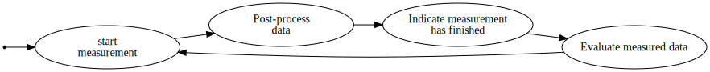

# SAML21 QTouch SelfCap example

The project bases on [saml21-helloworld-cpp](https://github.com/timkruse/saml21-helloworld-cpp.git) except that the makefile (and the vscode/tasks.json) is written for MacOS.
It shows the basic steps how to configure the Peripheral Touch Controller (PTC) on the SAML21 (ARM CM0+) microcontroller.
A single touch sensor is configured in self capacitance mode.
The sensor is connected to pin PA08 which corresponds to Y[\6\].

## Some initial notes by me

First, I would like to clarify something about the hardware which confused me a lot.
In the many QTouch documents provided by Atmel/Microchip you will come across circuit diagrams that show additional required hardware.
A capacitor and a resistor for each sensor node.
Those additional parts are only required if you do not have integrated PTC hardware.
Here, the SAML21 mcu is used and it has integrated PTC hardware.
Therefore, the sensor nodes can be connected directly to the respective pins.
The capacitive and resistive parts are part of the PTC peripheral.

Another thing that confused me is the high amount of different versions of the PTC library.
There is something shipped with the Atmel Software Framework (ASF) which can also be found in some of their documentations/application notes/user guides.
Then in some of their user guides they are again talking about other libraries and with their atmel start configurator you get again another set of libraries.
This makes the QTouch system very confusing and frustrating.

Since Atmel/Microchip wants its customers to use their board configurator ([Atmel Start](start.atmel.com)) and therefore I chose to go with the libraries they are using.
The used libraries are documented in the *QTouch Modular Library Peripheral Touch Controller User's Guide*.
Atmel Start bases on the new version of the ASF (ASF4) which looks great from an application engineer but the code behind looks horrible and is hard to understand and hard to follow.
There are lots of ```(void *)``` casts to hardware instances (Timers, ADCs, etc) which completely scraps the auto-complete and quick-look functionality.
So you always have to keep track about the underlying data structure when you are looking through their code.
And when you go through their code you will have to follow way too many functions that do nothing but calling another function.
Trying to understand how stuff works in the ASF4 is tedious and frustrating in my opinion.

In this example project I extracted the necessary code from the atmel start project and removed the abstraction layer.
The necessary code for dealing with the QTouch library is in the ```main.cpp``` file.

## General software flow


First, a timer (TC0) is configured to trigger the measurement every 20ms by setting the flag ```touch_measure_request = 1```.
Also, ```qtm_update_qtlib_timer(20)``` is called to tell QT lib that 20ms have passed since last update. (todo: Is this required ?)
Then the PTC is configured in ```touch_sensor_config()``` by first initializing the hardware and QTouch's acquisition module via ```qtm_ptc_init_acquisition_module(_)``` then ```qtm_ptc_qtlib_assign_signal_memory(_)``` is called (I don't know yet what it's purpose is) followed by the initialisation and calibration of the individual sensor nodes by calling ```qtm_enable_sensor_node(_,_)``` and ```qtm_calibrate_sensor_node(_,_)```.

This is the most basic setup.
The raw data from the acquisition module can be seen as a proximity value.
The touch key library uses the raw data to constrain the data according to the purpose of binary state: Touch detected and no touch detected.
In case of the touch key the raw data is compared against a threshold and if the proximity value exceeds a defined threshold a touch is detected.

Lastly, the interrupt handler for the PTC needs to be populated with dedicated functions from the QTouch lib: ```qtm_ptc_clear_interrupt()``` and ```qtm_saml21_ptc_handler_eoc()```.

After configuration a state machine comes into play.



The state machine checks if the timer has triggered and a new measurement should be started by calling ```qtm_ptc_start_measurement_seq(_,_)```.
The second argument of it is a callback function that is triggered when a measurement has been completed.
That callback triggers the post-processing function ```qtm_acquisition_process()``` followed by ```qtm_key_sensors_process()```.
Next, the measurement is confirmed by subsequent measurements (similar to debouncing) which is called *REBURST* in atmel's documentation.
Finally, the data is processed enough to querry the result by checking the individual sensor states.

To sum up, it's not that complicated but Atmel's documentation and their abstraction layer makes it hard to get started.
The most important part is to understand the purpose of the individual libraries which I did not understand by reading their user manual.
On the bottom layer there is a device specific library (```libqtm_acq_saml21_0x0026.a``` in this case) which handles the configuration of the PTC hardware and the most basic signal acquisition (exactly what the lib's name implies).
On top of that library you can install *modules* like the touch key / scroller / 2D surface.
They use the raw data of the acquisition module to constrain the signals depending on what they are intended for.

## Prerequisites

**Inherited from [saml21-helloworld-cpp](https://github.com/timkruse/saml21-helloworld-cpp.git) :**
1. [ARM Toolchain](https://developer.arm.com/tools-and-software/open-source-software/developer-tools/gnu-toolchain/gnu-rm)
2. [Atmel/Advanced Software Framework (ASF)](https://www.microchip.com/mplab/avr-support/advanced-software-framework)
3. [OpenOCD](https://gnutoolchains.com/arm-eabi/openocd/)

and the QTouch Libraries which are only available via [Atmel Start](start.atmel.com) but for this project they are already included in the ```qtouch``` folder.
Some of the libraries are device specific and more information about the structure can be found in their *QTouch Modular Library Peripheral Touch Controller User's Guide*

## Quick Start

1. Follow the [Setup](#Setup) steps
2. Connect a touch sensor to pin Y\[6\](PA08)
   1. I used a 5ct coin but anything made of copper should work. Adafruit also used fruits as sensor nodes [here](https://www.adafruit.com/product/2340)
3. Connect the debugger/programmer to chip and computer
4. Build the project
   1. ```make all```
5. Start the GDB Server
   1. ```make server_start```
6. Programm the chip
   1. ```make program```

A LED on PA27 should turn on when the sensor detects a touch and it should turn off again when the finger goes away.

## Setup

1. open makefile and change the path variables according to your installation

```makefile
#	ARM GCC installation path
ARM_GCC_PATH := ~/Applications/arm-dev/gcc-arm-none-eabi-8-2019-q3-update
#	OpenOCD installation path 
OPENOCD_PATH := ~/Applications/arm-dev/OpenOCD-20190715-0.10.0
#	ASF installation path
ASF_PATH := ~/Applications/arm-dev/xdk-asf-3.45.0
```

2. make sure you are in the projects directory with the current shell
```bash
$ cd [path to project]
```

3. Link project to the ASF

```bash
$ make links
```

This creates a folder in the project's directory called ```xdk-asf``` and creates softlinks to the necessary files in the ASF.
The necessary files are the register descriptions, the CMSIS definitions and the startup files. (Thanks to MickMake's tutorial [Program an Atmel SAM without an IDE](https://www.mickmake.com/post/program-atmel-sam-without-ide-tutorial))

4. In file xdk-asf/system_saml1.c add the *weak* attribute to the functions ```SystemInit``` and ```SystemCoreClockUpdate```
```cpp
void __attribute__((weak)) SystemInit(void){...}
void __attribute__((weak)) SystemCoreClockUpdate(void){...}
```
Adding this attribute to the functions let's us override them somewhere else without causing gcc to raise a ```multiple definition of 'function'``` error.

1. build it

```bash
$ make all
```
Don't forget to multithread this with the argument ```-j [Number of concurrent jobs]```
```bash
$ make -j 4 all
```

## Flash and Debug

1. make sure you are in the projects directory
```bash
$ cd [path to project]
```

2. Configure your debugging hardware in the ```openocd.cfg``` file. The one I used is the ARM-USB-OCD-H with the SWD adapter by Olimex.

```bash
# 1. Setup your debugger
source [find interface/ftdi/olimex-arm-usb-ocd-h.cfg]
# 2. and the SWD adapter if needed
source [find interface/ftdi/olimex-arm-jtag-swd.cfg]
```

3. start openocd server
Either manually in a seperate shell (makes sense if the debugging/flashing fails)
```bash
$ openocd
```
or in the same shell but started in the background
```bash
$ make server_start
```

To kill it if run in the background run 
```bash
$ make server_stop
```

4. run debug command (this automatically flashes the target but keeps open the gdb console)
```bash
$ make debug
```
then type in ```run``` or just ```r``` to reset and start the mcu.

or only for programming the target

```bash
$ make program
```
